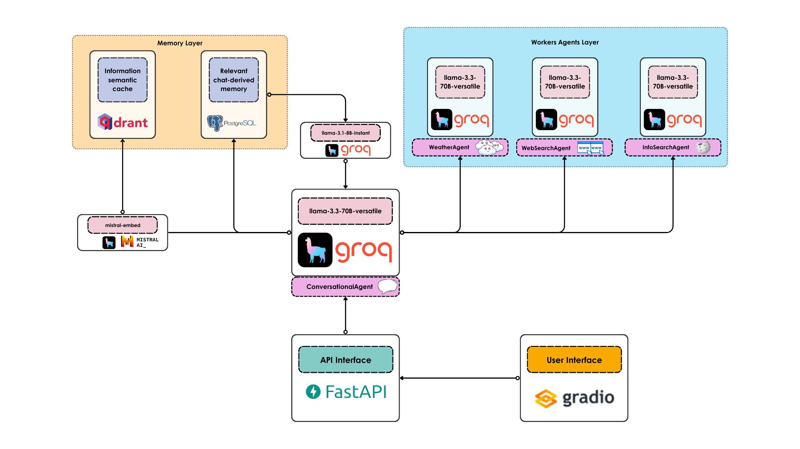

<h1 align="center">conversational.ai☕</h1>

<h2 align="center">You talk, AI talks</h2>

<div align="center">
    <h3>If you find conversational.ai userful, please consider to donate and support the project:</h3>
    <a href="https://github.com/sponsors/AstraBert"></a>
</div>
<br>
<div align="center">
    
</div>

## Install and launch🚀

The first step, common to both the Docker and the source code setup approaches, is to clone the repository and access it:

```bash
git clone https://github.com/AstraBert/conversational-ai.git
cd conversational-ai
```

Once there, you can choose one of the two following approaches:

### Docker (recommended)🐋

> _Required: [Docker](https://docs.docker.com/desktop/) and [docker compose](https://docs.docker.com/compose/)_

- Add the `groq_api_key`, the `tavily_api_key` and the `mistral_api_key` variables in the [`.env.example`](./docker/.env.example) file and modify the name of the file to `.env`. Get these keys:
    + [On Groq Console](https://console.groq.com/keys)
    + [On Tavily](https://app.tavily.com/home/)
    + [On Mistral Console](https://console.mistral.ai/api-keys/)

```bash
mv .env.example .env
```

- Launch the Docker application:

```bash
# If you are on Linux/macOS
bash start_services.sh
# If you are on Windows
.\start_services.ps1
```

You will see the application running on http://localhost:8000/app and you will be able to use it. Depending on your connection and on your hardware, the set up might take some time (up to 30 mins to set up) - but this is only for the first time your run it!


### Source code🗎

> _Required: [Docker](https://docs.docker.com/desktop/), [docker compose](https://docs.docker.com/compose/) and [conda](https://anaconda.org/anaconda/conda)_

- Add the `openai_api_key` and the `tavily_api_key` variables in the [`.env.example`](./docker/.env.example) file and modify the name of the file to `.env`. Get these keys:
    + [On OpenAI Platform](https://platform.openai.com/api-keys)
    + [On Tavily](https://app.tavily.com/home/)

```bash
mv .env.example .env
```

- Set up LlamaIndex Docs Agent using the dedicated script:

```bash
# For MacOs/Linux users
bash setup.sh
# For Windows users
.\setup.ps1
```

- Or you can do it manually, if you prefer:

```bash
docker compose up qdrant postgres adminer -d

conda env create -f environment.yml

conda activate conversational-agent

python3 scripts/cache.py

cd scripts

uvicorn main:app --host 0.0.0.0 --port 8000

conda deactivate
```

You will see the application running on http://localhost:8000/app and you will be able to use it.

## How it works

<div align='center'>
    
</div>

### Database services

- **Postgres** manages the chat-based memory that the main agent can update and access, containing important information deriving from the conversation
- **Adminer** is a database management and control system, that lets you check your Postgres databases
- **Qdrant** is a vector database services, in which the semantic cache is stored. The embeddings are generated by `mistral-embed`.

### Workflow

Whenever the user asks a question from the Gradio chat interface running on http://localhost:8000/app, this question is processed by the `/chat` endpoint of the FastAPI-managed API to which the Gradio app is attached. The `/chat` endpoint passes the user message to the main ReAct agent, ConversationalAgent, which:

- Can upload the information to the Postgres-managed memory, associating it to the user and to the importance score
- Can pull the information from the memory, extracting useful pieces of it from the last 30 messages thanks to a secondary LLM
- Can hand off the control to the NewsSearchAgent, that will search the web for news (if the user asked to know news about a topic)
- Can hand off the control to the InfoSearchAgent, that will query Wikipedia to retrieve relevant information related to a particular topic. THe information will be stored in the semantic cache, that could be searched in following query if the user asks for similar questions
- Can hand off the control to the WeatherSearchAgent, that will find out weather details about a specific location
- After getting information from agents and tools, the ConversationalAgent will return a final response to the user

## Contributing

Contributions are always welcome! Follow the contributions guidelines reported [here](CONTRIBUTING.md).

## License and rights of usage

The software is provided under MIT [license](./LICENSE).
